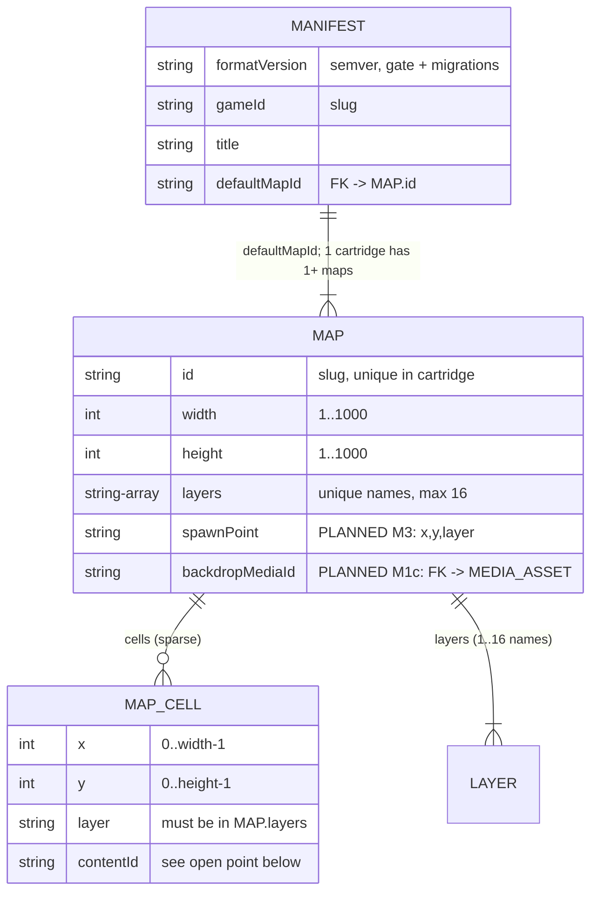
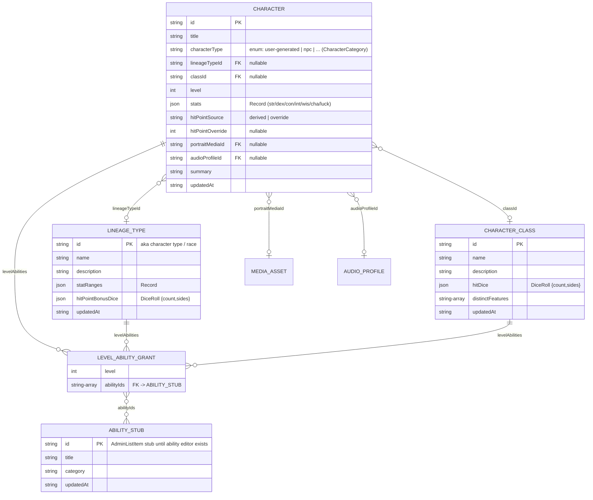
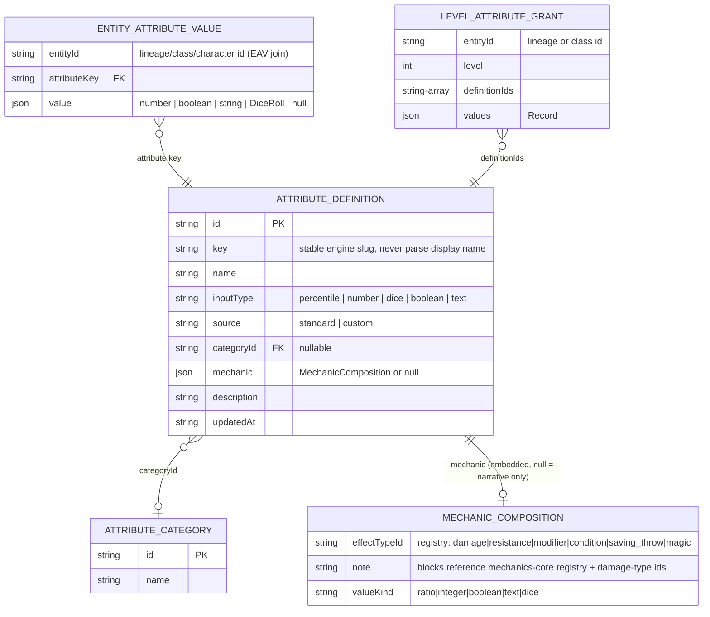
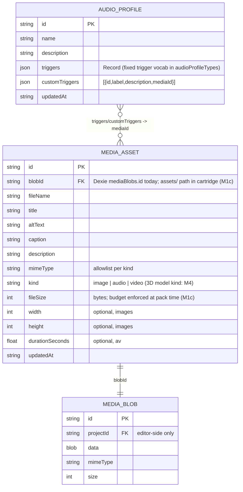
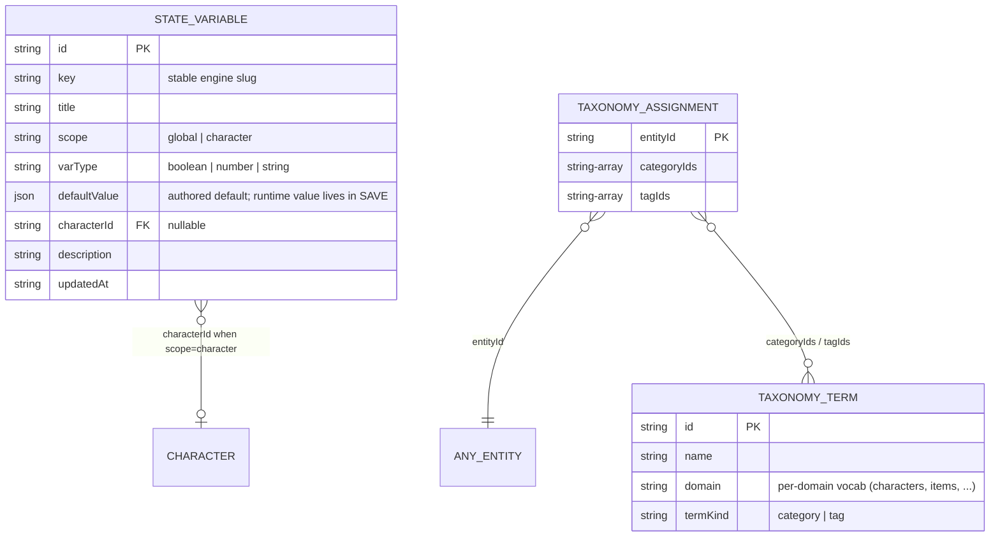
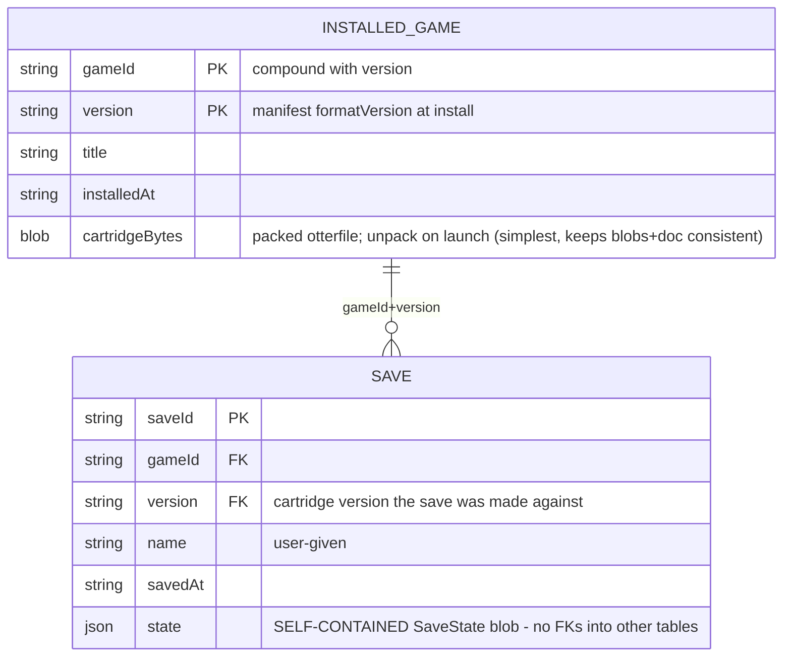

# Otter — Data & Database Schema

> Reference for all persisted data: what exists today, and the target shape that `TODO.md` milestones build toward. Companion to `roadmap.md`.
>
> There is **no server database**. Otter has three persistence surfaces, all client-side:
>
> 1. **Motherotter IndexedDB** (Dexie, db name `motherotter`) — editor working state
> 2. **The `.otterfile` cartridge** (zip) — the portable, read-only-at-play content schema
> 3. **Gameotter IndexedDB** (Dexie, db name `gameotter`, *planned*) — installed games + saves
>
> The **logical content schema** (entities below) is shared by all three. Milestone 1's whole point is that its single source of truth becomes Zod schemas in `otterfile-core`; Dexie tables and zip files are just containers for it.
>
> Legend: ✅ exists today · 🔶 exists in editor only, not yet in cartridge · 🎯 planned (milestone in parentheses)

---

## 1. Logical content schema (the cartridge domain model)

### 1.1 Conventions

- **Ids** are slugs/UUID-ish strings, unique per entity type within one project/cartridge. Prefixes where used: `proj_…` (projects), `game-…` (gameIds).
- **`key` vs `id`**: entities consumed by the engine (attributes, state variables) carry a stable machine `key` (slug) in addition to `id`; engine logic binds to keys/registry ids, never display names.
- **Timestamps** are ISO-8601 strings (`updatedAt` on every editable entity).
- **References are by id, validated at the boundary** (Zod `superRefine`, like the existing `defaultMapId` check). No dangling-id is allowed to survive a pack or an import.
- **All maps/grids are sparse** — only occupied cells are stored, keyed `"x,y,layer"`. Never dense arrays.

### 1.2 World / maps — ✅ in cartridge today



> **Open design point (resolve in Milestone 1/3):** `MAP_CELL.contentId` is currently a free-form brush string (`character:hero`, `item:sword`…). Target: a discriminated reference `{ kind: 'character' | 'item' | 'container' | 'entrance' | 'terrain', id: string }` validated against the content tables below, so a placed cell can carry a *specific* authored character. Until then, placements and authored characters are unlinked.

### 1.3 Characters domain — 🔶 editor-only (cartridge: M1b)



Derived, never stored: compiled combat stats (`mechanics-core.compileCombatStats`) — recomputed from lineage + class + attributes at load/session start.

### 1.4 Attributes & mechanics domain — 🔶 editor-only (cartridge: M1b)



Stored today as one `AttributesContent` blob: `{ categories[], definitions[], entityValues: Record<entityId, Record<key, value>>, customAssignments: Record<entityId, defIds[]>, levelAttributeGrants: Record<entityId, grants[]> }`. The EAV records above are its normalized reading — keep the blob shape, but document it as these three relations.

Registry ids (attribute types, damage-type groups/subtypes, stacking rules) live in **`mechanics-core`** (`registry.ts`, `damageTypes.ts`, see `MECHANICS_MANIFEST.md`) and are *code-defined vocabulary*, not user data. Cartridge stores compositions that reference registry ids; the engine compiles them.

### 1.5 Media & audio domain — 🔶 editor-only (cartridge: M1c)



In the cartridge (M1c), `MEDIA_BLOB` becomes a file at `assets/<id>` and `MEDIA_ASSET` is the manifest row pointing at it. Validate on unpack: size, mime allowlist, no `../` paths.

### 1.6 State, taxonomy, catalog stubs — 🔶 editor-only (cartridge: M1a/M1b)



**Catalog stubs** (`stories`, `items`, `containers`, `abilities`, `rules`): plain `AdminListItem` rows (`id, title, category, updatedAt`) reserving ids until each domain gets a real editor. Ship them in the cartridge as-is (M1b) so ids stay stable when the real schemas arrive.

---

## 2. Physical store: Motherotter IndexedDB (`motherotter`)

Current Dexie schema — `apps/motherotter/src/lib/db.ts`:

```ts
// version 2 (current)
projects:   'projectId, gameId, updatedAt'   // StoredProject rows, content embedded as one blob
settings:   'id'                             // singleton AppSettings { lastProjectId, autosaveEnabled }
mediaBlobs: 'id, projectId, updatedAt'       // StoredMediaBlob (Blob data lives here, not in projects)
```

`StoredProject` (one row per editor project):

```
projectId PK · gameId · title · formatVersion · createdAt · updatedAt
mapId · activeLayer · selectedTool · activeMode · mapBackdropMediaId     ← editor UI state
mediaMaxFileBytes · mediaProjectSoftBudgetBytes                          ← budgets
world: SerializedWorld { width, height, layers[], cells[] }              ← single map (see below)
content?: ProjectContent { all §1.3–1.6 entities as one embedded blob }
```

Planned changes:

- 🎯 (M1b) **version 3**: add explicit `schemaVersion` to `StoredProject`; migrations run through the same pipeline as cartridge `formatVersion` instead of shape-sniffing (`races` → `characterTypes`).
- 🎯 (M1) `content` blob becomes "parsed by `otterfile-core` schemas" rather than app-defined; same physical shape.
- 🎯 (post-M1) `world` → `maps: SerializedWorld[]` once the editor supports multiple maps per project (cartridge already does).
- Deliberate non-goals: no per-entity Dexie tables (the embedded-blob-per-project model keeps autosave atomic and is plenty at this scale); media blobs stay in their own table so project rows stay small.

---

## 3. Physical store: the `.otterfile` cartridge (zip)

```
manifest.json                 ✅ { formatVersion, gameId, title, defaultMapId }
maps/<mapId>.json             ✅ one file per map (§1.2)
content/state-variables.json  🎯 M1a
content/taxonomy.json         🎯 M1b
content/attributes.json       🎯 M1b   (categories, definitions, EAV blobs §1.4)
content/character-classes.json· content/lineage-types.json   🎯 M1b
content/characters.json       🎯 M1b
content/audio-profiles.json   🎯 M1b
content/catalog-stubs.json    🎯 M1b
content/media-manifest.json   🎯 M1c   (MEDIA_ASSET rows; blobId = path under assets/)
assets/<blobId>               🎯 M1c   (raw media bytes; budget + mime enforced at pack)
```

Rules (already enforced for manifest+maps, extend to all of the above):
- Every file Zod-validated on unpack; cartridges are untrusted input. No eval, no path traversal.
- Missing `content/*` file ⇒ empty collection (keeps v0.1 files loading).
- `formatVersion` bump + migration for every breaking change; `migrate.ts` is the only door.

---

## 4. Physical store: Gameotter IndexedDB (`gameotter`) — 🎯 all M2

```ts
// version 1 (planned)
installedGames: '[gameId+version], gameId, title, installedAt'
saves:          'saveId, [gameId+version], updatedAt'
settings:       'id'
```



`SaveState` (defined in `game-state`, Zod, versioned independently of the cartridge — M2b, grows in M3):

```
schemaVersion        — save format version, own migration path
mapId                — active map
party                — [{ characterId, x, y, layer, hp, ... }]        (M3)
stateValues          — Record<StateVariable.key, value>  ← runtime values of §1.6 authored defaults
terminalLog?         — recent text events                              (M3, optional)
```

Design rules: saves are **opaque self-contained blobs** (the future sync service uploads/downloads them without understanding them); a save references its cartridge by `gameId+version` only; compatibility policy when versions mismatch is decided in M2b.

---

## 5. Future: Otterden (server) — deferred, shape-only

No backend until Milestones 1–3 hold. When it comes, the contract is already fixed by the above: a cartridge registry is rows of `{ gameId, version, title, bytes }` (≙ `INSTALLED_GAME`), and cloud saves are opaque `SAVE.state` blobs keyed by user + `gameId+version`. Nothing in §1–4 may grow a dependency on a server to stay valid.
